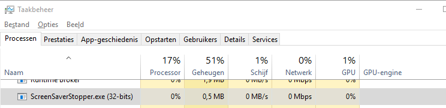

# ScreensaverStopper

This application sends the F24 keystroke every 40 seconds. 
This way, windows should not activate the screensaver.

Useful if you do not have rights to disable the screensaver, but can run executables.

There is no window, no output, no settings, just a keystroke every 40 seconds. 
If you need to stop the application, use the task manager.

It's written in C++, compiled with GCC 8.1 via MinGW. Filesize is around 14 KB, 
memory usage after a day of running around 600KB.

[Author: Remy van Elst](https://raymii.org), license: GNU GPLv3.  